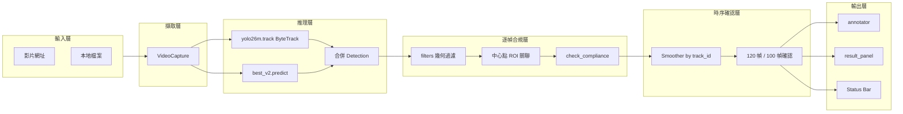
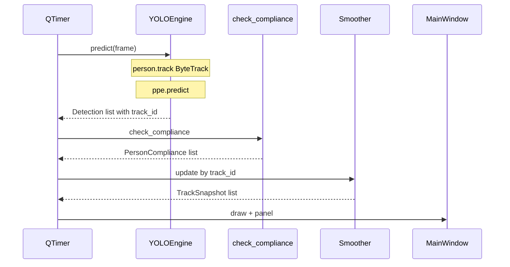

# 工人 PPE 合規偵測 — 系統架構文件

## 1. 專案目標與需求

### 1.1 目標

對影片或攝影機畫面中的工人，使用 YOLO 即時偵測並判斷是否：

- 佩戴**安全帽**（helmet / hard-hat）
- 穿著**反光背心**（reflective vest / safety-vest）

系統以桌面 GUI 呈現即時標註、右側結果面板與合規狀態，供現場或回放影片快速檢視。

### 1.2 合規定義

合規判定分三階段：**幾何過濾** → **逐幀中心點關聯** → **時序確認**（120 幀 / 100 幀命中，見 §5.6）。

| 狀態 | 條件（逐幀） |
|------|-------------|
| **COMPLIANT** | `person` 通過過濾，helmet 中心在 Head ROI、vest 中心在 Torso ROI |
| **NO_HELMET** | 有 person、有 vest、無 helmet |
| **NO_VEST** | 有 person、有 helmet、無 vest |
| **NO_PPE** | 有 person，兩者皆無 |
| **PERSON_ONLY** | 時序層：person 已確認，但 helmet / vest 皆未達確認門檻 |

UI 標籤（英文，[`ppe/types.py`](ppe/types.py)）：

| 狀態 | 標籤 |
|------|------|
| COMPLIANT | Compliant |
| NO_HELMET | No Hard Hat |
| NO_VEST | No Safety Vest |
| NO_PPE | Missing Hard Hat and Safety Vest |
| PERSON_ONLY | Person Only |

### 1.3 非目標（v1 不納入）

- DeepSORT / Re-ID 特徵追蹤（使用 Ultralytics 內建 ByteTrack）
- 後台 Web 報表或資料庫
- 邊緣裝置部署腳本
- 自動告警推播

---

## 2. 可靠度問題與修正（v3.0）

### 2.1 已知問題根因

| 問題 | 根因 | v3.0 修正 |
|------|------|-----------|
| 同一人重複標定 | 自製 IoU 追蹤器在框抖動時新建 track ID | person 模型改用 **ByteTrack**（`model.track(persist=True)`） |
| 有戴 PPE 卻判 NO_PPE | IoU 對「小 PPE 框 vs 大 ROI」恆 < 0.3 | 改為 **PPE 中心點落在 ROI 內** |
| 偶發誤判 | 無幾何過濾 | 新增 [`ppe/filters.py`](ppe/filters.py) |

IoU 失效示例：helmet 30×25、head ROI 120×90 → IoU ≈ 0.07，永遠低於 0.3 閾值。

### 2.2 現行核心流程

```python
# ui/main_window.py
detections = self.engine.predict(frame)           # person: ByteTrack + track_id；ppe: predict
frame_results = check_compliance(                # filters + 中心點關聯
    detections, frame_shape=frame.shape,
    filters_cfg=..., association_cfg=...,
)
tracks = self.smoother.update(frame_results)      # 依 track_id 時序平滑
annotated = draw_frame(frame, detections, tracks, ...)
self.result_panel.update_results(tracks, ...)
```

---

## 3. 系統架構總覽



### 3.1 各層職責

| 層級 | 模組 | 職責 |
|------|------|------|
| 推理 | [`detector/yolo_engine.py`](detector/yolo_engine.py) | person `.track()` 取 track_id；ppe `.predict()` |
| 過濾 | [`ppe/filters.py`](ppe/filters.py) | 過小 / 過大 / 異常長寬比 person 丟棄 |
| 關聯 | [`ppe/associator.py`](ppe/associator.py) | ROI 切割、中心點判定 |
| 合規 | [`ppe/compliance.py`](ppe/compliance.py) | 組裝 `PersonCompliance` |
| 時序 | [`ppe/smoother.py`](ppe/smoother.py) | 依 track_id 滑動窗口確認 |
| 輸出 | [`ui/`](ui/) | 畫框、右側面板 |

---

## 4. 模型策略

### 4.1 雙模型分工

| 權重檔 | 方法 | 原始類別 | 內部名稱 | 附帶 |
|--------|------|----------|----------|------|
| `yolo26m.pt` | `.track(persist=True)` | `person` | `person` | **track_id** |
| `best_v2.pt` | `.predict()` | `hard-hat` | `helmet` | — |
| `best_v2.pt` | `.predict()` | `safety-vest` | `reflective_vest` | — |

### 4.2 類別映射

```yaml
models:
  person:
    tracker: "bytetrack.yaml"
    class_map:
      person: person
  ppe:
    class_map:
      hard-hat: helmet
      safety-vest: reflective_vest
```

載入新影片時呼叫 `engine.reset()` 清除 ByteTrack 狀態。

---

## 5. 合規判斷邏輯

### 5.1 資料結構（[`ppe/types.py`](ppe/types.py)）

```python
@dataclass
class Detection:
    class_name: str
    bbox: tuple
    confidence: float
    track_id: int | None = None   # person 由 ByteTrack 提供

@dataclass
class PersonCompliance:
    person_bbox: tuple
    status: ComplianceStatus
    has_helmet: bool
    has_vest: bool
    confidence: float
    track_id: int | None = None
```

### 5.2 幾何過濾（[`ppe/filters.py`](ppe/filters.py)）

| 規則 | 預設 | 說明 |
|------|------|------|
| 過小 | h < 30px | 距離過遠 |
| 過大 | 面積 > 畫面 70% | 距離過近或誤判 |
| 長寬比 | w/h > 1.5 | 非站立姿態 |

### 5.3 空間關聯（[`ppe/associator.py`](ppe/associator.py) + [`ppe/compliance.py`](ppe/compliance.py)）

**ROI 切割**（供 `visualize()` 繪製參考框）：

```
head_roi  = (x1, y1, x2, y1 + h/3)           頂部 1/3
torso_roi = (x1, y1 + h/3, x2, y1 + h/3 + h/2)  中段 1/2
```

**合規判定**（CLAUDE.md §3）：PPE 框**中心點** `(cx, cy)` 落在**該工人 person 框內**：

- `helmet` 中心在 person 框內 → `has_helmet = True`
- `reflective_vest` 中心在 person 框內 → `has_vest = True`

**孤立裝備過濾**：中心點未落在任一 person 框內的 PPE 不繪製、不納入合規統計。

### 5.4 逐幀狀態判定

```
if has_helmet and has_vest:        → COMPLIANT
elif not has_helmet and has_vest:  → NO_HELMET
elif has_helmet and not has_vest:   → NO_VEST
else:                               → NO_PPE
```

### 5.5 視覺標示

| 狀態 | 顏色 key | 用途 |
|------|----------|------|
| 合規 | `compliant` 綠 | 工人框 |
| 違規 | `violation` 紅 | 工人框 |
| 僅 person | `person_only` 橘 | 累積中或未確認 PPE |
| PPE | `ppe` 天藍 | helmet / vest 框 |

框上文字：`#track_id` + 英文狀態（如 `#3 Compliant`）。

### 5.6 時序確認（[`ppe/smoother.py`](ppe/smoother.py)）

- 以 **ByteTrack track_id** 為 key，不再 IoU 重配對
- 滑動窗口 `deque(maxlen=120)`，各狀態命中 ≥ **100** 幀才確認
- track_id 連續 **300** 幀未出現 → 從記憶體移除

```
confirmed_helmet = helmet_hits >= confirm_threshold
confirmed_vest   = vest_hits   >= confirm_threshold
```

輸出 `TrackSnapshot` 供 UI 與 annotator 使用。  
[`ppe/temporal_tracker.py`](ppe/temporal_tracker.py) 保留為向後相容別名（指向 `Smoother`）。

---

## 6. 模組化目錄結構

```
yolo_opencv_test/
├── app.py
├── config/
│   ├── __init__.py
│   └── settings.yaml          # 唯一生效設定
├── detector/
│   ├── __init__.py
│   └── yolo_engine.py         # ByteTrack + PPE predict
├── ppe/
│   ├── types.py               # Detection, ComplianceStatus
│   ├── filters.py             # 幾何過濾
│   ├── associator.py          # 中心點 ROI 關聯
│   ├── compliance.py          # check_compliance()
│   ├── smoother.py            # Smoother（時序平滑）
│   └── temporal_tracker.py    # 向後相容 re-export
├── ui/
│   ├── main_window.py
│   ├── annotator.py
│   └── result_panel.py
├── yolo26m.pt                  # gitignore
├── best_v2.pt                  # gitignore
├── requirements.txt
└── 架构.md
```

### 6.1 模組介面

```python
# detector/yolo_engine.py
class YOLOEngine:
    def predict(self, frame) -> list[Detection]: ...
    def reset(self) -> None: ...

# ppe/compliance.py
def check_compliance(
    detections, frame_shape, filters_cfg, association_cfg
) -> list[PersonCompliance]: ...

# ppe/smoother.py
class Smoother:
    def update(self, frame_results) -> list[TrackSnapshot]: ...
    def reset(self) -> None: ...
```

### 6.2 逐幀資料流



---

## 7. 配置（[`config/settings.yaml`](config/settings.yaml)）

```yaml
models:
  person:
    path: "yolo26m.pt"
    tracker: "bytetrack.yaml"
    conf_threshold: 0.4
    iou_threshold: 0.45
    imgsz: 640
    class_map:
      person: person
  ppe:
    path: "best_v2.pt"
    conf_threshold: 0.5
    class_map:
      hard-hat: helmet
      safety-vest: reflective_vest

filters:
  min_person_height: 30
  max_area_ratio: 0.7
  max_aspect_ratio: 1.5

association:
  method: center_in_roi
  head_ratio: 0.333
  torso_ratio: 0.5

temporal:
  window_size: 120
  confirm_threshold: 100
  max_missed_frames: 300
```

> 根目錄 [`settings.yaml`](settings.yaml) 為早期草稿，程式不讀取。

---

## 8. 技術棧

| 元件 | 用途 |
|------|------|
| Python 3.9+ | 執行環境（`from __future__ import annotations`） |
| Ultralytics YOLO 8.x | 推理 + ByteTrack |
| OpenCV | 影片、畫框 |
| PySide6 | GUI |
| PyYAML | 設定 |

---

## 9. 里程碑

| 步驟 | 內容 | 狀態 |
|------|------|------|
| 1–8 | Phase 1 模組化、雙模型、UI | 完成 |
| 9 | v3.0 可靠度重構（ByteTrack + 中心點 + filters + smoother） | 完成 |
| 10 | Phase 2：微調 PPE 模型 | 待進行 |

---

## 10. 附錄：update_frame 完整路徑

```python
detections = self.engine.predict(frame)

frame_results = check_compliance(
    detections,
    frame_shape=frame.shape,
    filters_cfg=self.filters_cfg,
    association_cfg=self.association_cfg,
)

tracks = self.smoother.update(frame_results)
annotated = draw_frame(frame, detections, tracks, self.visualizer_cfg)
self.result_panel.update_results(tracks, self.frame_index)
```

載入新影片：

```python
self.engine.reset()
self.smoother.reset()
```

---

*文件版本：v3.0 | 最後更新：2026-06-24*
