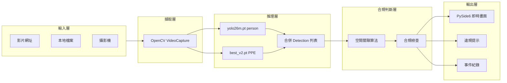
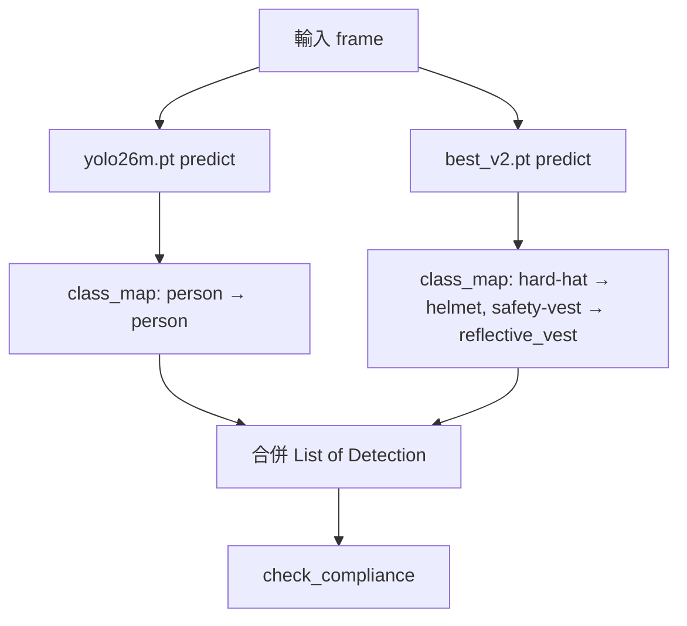
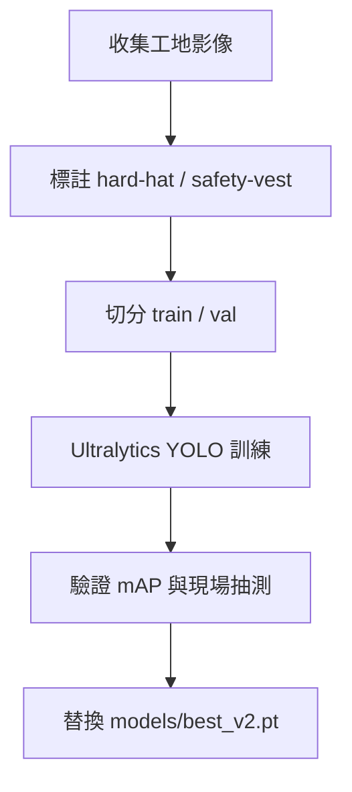
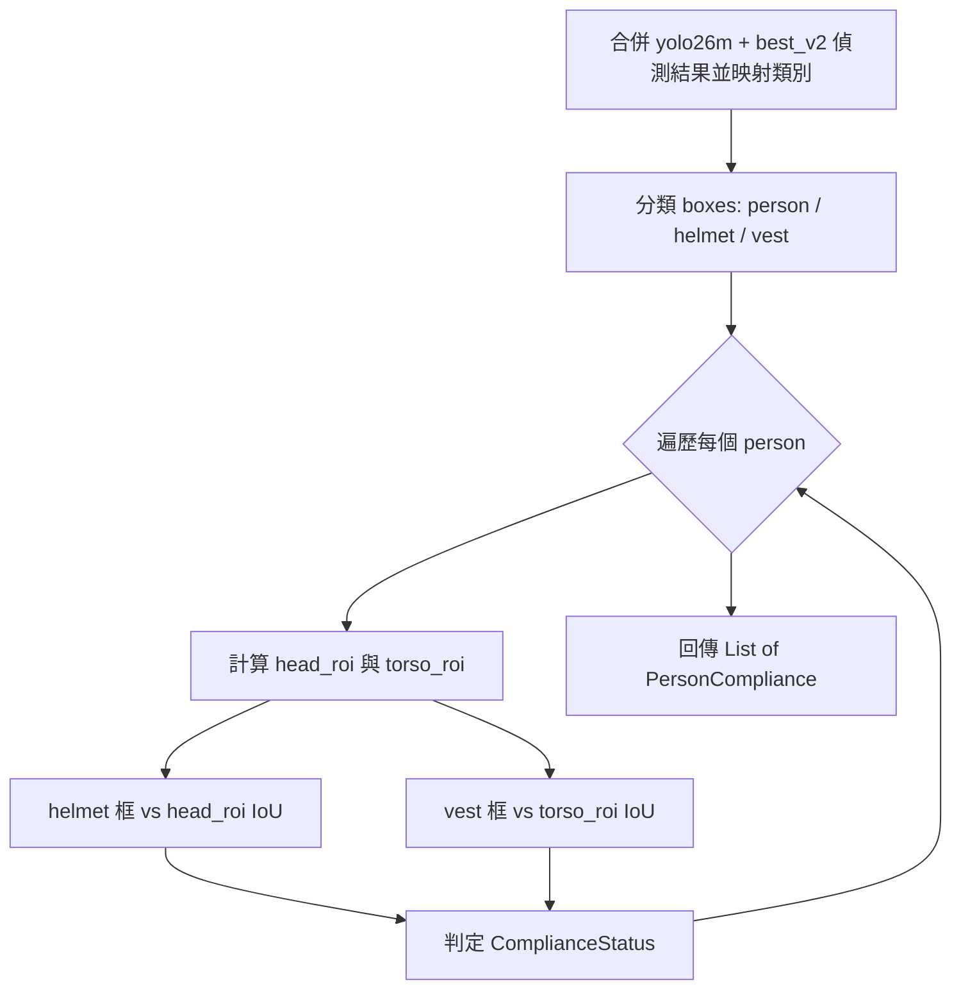
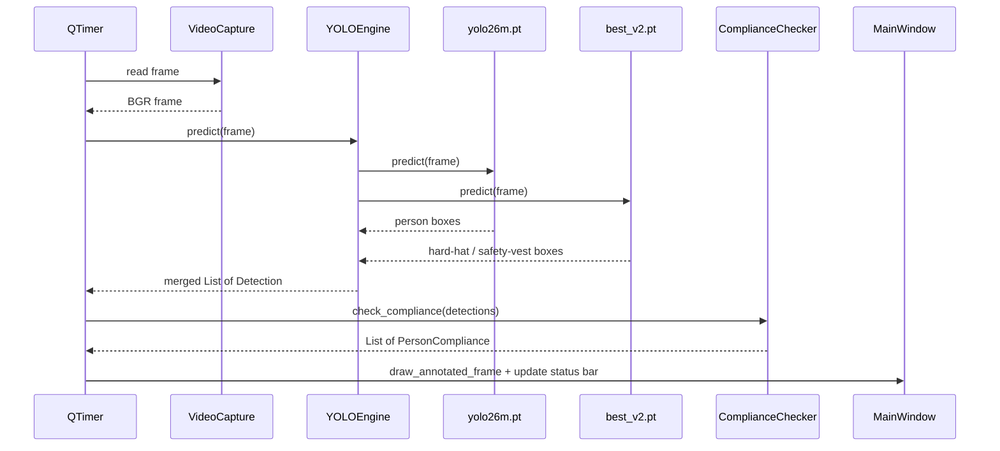
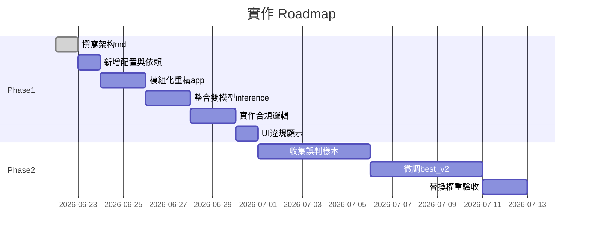

# 工人 PPE 合規偵測 — 系統架構文件

## 1. 專案目標與需求

### 1.1 目標

對影片或攝影機畫面中的工人，使用 YOLO 即時偵測並判斷是否：

- 佩戴**安全帽**（helmet）
- 穿著**反光背心**（reflective vest）

系統以桌面 GUI 呈現即時標註與合規狀態，供現場或回放影片快速檢視。

### 1.2 合規定義

| 狀態 | 條件 |
|------|------|
| **合規**（COMPLIANT） | 偵測到 `person`，且頭部區域關聯到 `helmet`、軀幹區域關聯到 `reflective_vest` |
| **未戴安全帽**（NO_HELMET） | 偵測到 `person`，頭部區域無 `helmet` 關聯，但有穿背心 |
| **未穿背心**（NO_VEST） | 偵測到 `person`，軀幹區域無 `reflective_vest` 關聯，但有戴安全帽 |
| **兩者皆缺**（NO_PPE） | 偵測到 `person`，頭部與軀幹皆無對應 PPE 關聯 |

### 1.3 非目標（v1 不納入）

- 跨幀多人追蹤（Re-ID）
- 後台 Web 報表或資料庫
- 邊緣裝置（NVIDIA Jetson 等）部署腳本
- 自動告警推播（Email / LINE 等）

---

## 2. 現況與差距分析

目前專案僅有 [`app.py`](app.py)，為 **PySide6 + OpenCV + Ultralytics YOLO** 的即時影片偵測工具。核心流程如下：

```python
# app.py — update_frame 現有邏輯
ret, frame = self.cap.read()
results = self.model(frame, verbose=False)
annotated_frame = results[0].plot()
```

### 2.1 可保留的部分

| 功能 | 位置 | 說明 |
|------|------|------|
| Google Drive URL 解析 | `parse_google_drive_url()` | 分享連結轉直連下載 |
| 影片載入 | `load_video()` | OpenCV `VideoCapture` |
| 計時器刷新 | `QTimer` 30ms | 約 33 FPS |
| 影像顯示策略 | `setMinimumSize(640, 480)` + 手動 `KeepAspectRatio` | 避免 Layout 撐大視窗 |
| GUI 框架 | PySide6 佈局 | 輸入框、按鈕、影像 Label |
| person 偵測模型 | `yolo26m.pt` | COCO 通用模型，可偵測 `person` |

### 2.2 需擴充的部分

| 問題 | 現況 | 目標 |
|------|------|------|
| 模型 | 僅 `yolo26m.pt`（COCO，無 PPE 類別） | **雙模型並用**：`yolo26m.pt` 偵測 person + `best_v2.pt` 偵測 PPE |
| 推理結果 | 直接 `plot()` 畫框 | 雙模型 inference → 合併 Detection → 合規判斷 → 自訂標註 |
| 配置 | 硬編碼模型路徑 | `config/settings.yaml` 可配置兩個模型與 class_map |
| 模組化 | 單一 163 行檔案 | 拆分 detector / ppe / ui |

**關鍵限制**：`yolo26m.pt` 為 COCO 模型，無 `helmet`、`reflective_vest` 類別，無法單獨達成 PPE 合規偵測。需搭配 `best_v2.pt`（偵測 `hard-hat`、`safety-vest`），在推理層合併結果後，再由合規判斷層做 person 與 PPE 的空間關聯。

---

## 3. 系統架構總覽

系統採五層架構：輸入 → 擷取 → 推理 → 合規判斷 → 輸出。



### 3.1 各層職責

| 層級 | 模組（規劃） | 職責 |
|------|-------------|------|
| 輸入層 | `ui/main_window.py` | 接收 URL、本地路徑或攝影機索引 |
| 擷取層 | `ui/main_window.py` | `cv2.VideoCapture` 逐幀讀取 |
| 推理層 | `detector/yolo_engine.py` | 載入 `yolo26m.pt` 與 `best_v2.pt`、並行 predict、class_map 映射後合併 |
| 合規判斷層 | `ppe/associator.py`、`ppe/compliance.py` | person 與 PPE 空間關聯、輸出合規狀態 |
| 輸出層 | `ui/main_window.py` | 繪製標註、Status Bar 違規計數、（可選）寫入 log |

---

## 4. 模型策略

### 4.1 雙模型分工

系統採**雙模型並行 inference**，各負責不同類別，結果合併後送入合規判斷層。

| 權重檔 | 用途 | 原始類別名稱 | 內部統一名稱 |
|--------|------|-------------|-------------|
| `yolo26m.pt` | 偵測工人 | `person`（COCO） | `person` |
| `best_v2.pt` | 偵測安全帽 | `hard-hat` | `helmet` |
| `best_v2.pt` | 偵測反光背心 | `safety-vest` | `reflective_vest` |

### 4.2 類別映射

各模型輸出的類別名稱透過 `settings.yaml` 的 `class_map` 映射為內部統一名稱，合規邏輯層只處理 `person` / `helmet` / `reflective_vest`。

**yolo26m.pt（COCO）：**

```yaml
class_map:
  person: person
```

**best_v2.pt（PPE）：**

```yaml
class_map:
  hard-hat: helmet
  safety-vest: reflective_vest
```

映射在 `detector/yolo_engine.py` 的 predict 階段完成，合規層無需感知原始類別名稱。

### 4.3 內部統一類別定義

| 內部類別名稱 | 來源模型 | 原始類別名稱 | 說明 |
|-------------|----------|-------------|------|
| `person` | `yolo26m.pt` | `person` | 工人（全身或半身） |
| `helmet` | `best_v2.pt` | `hard-hat` | 安全帽 |
| `reflective_vest` | `best_v2.pt` | `safety-vest` | 反光背心 |

### 4.4 推理合併流程



### 4.5 Phase 2 優化路徑

- **Phase 1（現況）**：直接使用 `yolo26m.pt` + `best_v2.pt` 跑通完整流程。
- **Phase 2（可選）**：收集現場誤判樣本，僅對 `best_v2.pt` 做微調再訓練；`yolo26m.pt` 可繼續沿用，推理層介面不變。

### 4.6 PPE 模型再訓練流程概要（Phase 2）



建議資料集比例：train 80% / val 20%，每類至少 200 張以上標註框以獲得穩定效果。person 偵測仍由 `yolo26m.pt` 負責，PPE 訓練資料集無需標註 person。

---

## 5. 合規判斷邏輯

現有 `app.py` 僅呼叫 `results[0].plot()`，缺少 person 與 PPE 的關聯判斷。此為系統核心新增模組。

合規層的輸入為 `detector/yolo_engine.py` 合併兩模型結果、並完成 `class_map` 正規化後的 `List[Detection]`。

### 5.1 資料結構

```python
# ppe/compliance.py — 規劃介面

from enum import Enum
from dataclasses import dataclass

class ComplianceStatus(Enum):
    COMPLIANT = "compliant"       # 合規
    NO_HELMET = "no_helmet"       # 未戴安全帽
    NO_VEST = "no_vest"           # 未穿背心
    NO_PPE = "no_ppe"             # 兩者皆缺

@dataclass
class Detection:
    class_name: str   # person / helmet / reflective_vest（已映射後的統一名稱）
    bbox: tuple       # (x1, y1, x2, y2)
    confidence: float

@dataclass
class PersonCompliance:
    person_bbox: tuple
    status: ComplianceStatus
    has_helmet: bool
    has_vest: bool
    confidence: float
```

### 5.2 空間關聯算法

對每一個 `person` 偵測框，執行以下步驟：

**Step 1 — 分割 ROI**

將 person bbox `(x1, y1, x2, y2)` 依高度三等分：

```
head_roi   = (x1, y1, x2, y1 + h/3)       # 上 1/3 → 頭部
torso_roi  = (x1, y1 + h/3, x2, y1 + 2h/3) # 中 1/3 → 軀幹
```

其中 `h = y2 - y1`。

**Step 2 — IoU 關聯**

對所有 `helmet` 框，計算與 `head_roi` 的 IoU；對所有 `reflective_vest` 框，計算與 `torso_roi` 的 IoU。

```
IoU(A, B) = area(A ∩ B) / area(A ∪ B)
```

若任一 helmet 框 IoU > `helmet_iou_threshold`（預設 0.3）→ `has_helmet = True`  
若任一 vest 框 IoU > `vest_iou_threshold`（預設 0.3）→ `has_vest = True`

**Step 3 — 狀態判定**

```
if has_helmet and has_vest:   → COMPLIANT
elif not has_helmet and has_vest: → NO_HELMET
elif has_helmet and not has_vest: → NO_VEST
else:                         → NO_PPE
```

### 5.3 關聯流程圖



### 5.4 視覺標示規則

取代 `results[0].plot()`，改由合規模組自訂繪製：

| 狀態 | 框線顏色 | 標籤文字 |
|------|----------|----------|
| COMPLIANT | 綠色 `(0, 255, 0)` | `合規` |
| NO_HELMET | 紅色 `(0, 0, 255)` | `未戴安全帽` |
| NO_VEST | 紅色 `(0, 0, 255)` | `未穿反光背心` |
| NO_PPE | 紅色 `(0, 0, 255)` | `未戴安全帽 / 未穿反光背心` |

- PPE 物件（helmet、vest）以半透明藍框標示，不覆蓋 person 合規框。
- Status Bar 顯示本幀統計：`合規 N 人 | 違規 M 人`。

### 5.5 邊界情況處理

| 情況 | 處理方式 |
|------|----------|
| 僅偵測到 helmet/vest，無 person | 忽略，不輸出合規狀態 |
| 多人重疊 | 各自獨立計算 ROI 與 IoU，不做跨 person 的 PPE 共享 |
| 低信心度偵測 | 低於各模型 `conf_threshold` 的 box 在推理層過濾，不進入合規邏輯 |
| person 框過小（h < 30px） | 跳過該 person，避免 ROI 分割失真 |

---

## 6. 模組化目錄結構

基於 [`app.py`](app.py) 重構為可維護結構，作為後續實作藍圖：

```
yolo_opencv_test/
├── app.py                  # 入口：建立 QApplication，啟動 MainWindow
├── config/
│   └── settings.yaml       # 雙模型路徑、閾值、class_map
├── detector/
│   ├── __init__.py
│   └── yolo_engine.py      # 雙模型載入、inference、合併
├── ppe/
│   ├── __init__.py
│   ├── associator.py       # person ↔ helmet/vest 空間關聯（IoU 計算）
│   └── compliance.py       # ComplianceStatus、PersonCompliance、check_compliance()
├── ui/
│   ├── __init__.py
│   └── main_window.py      # 原 YOLOApp 類別移入
├── models/
│   ├── yolo26m.pt          # person 偵測（COCO）
│   └── best_v2.pt          # hard-hat / safety-vest 偵測（加入 .gitignore）
├── requirements.txt
└── 架构.md
```

### 6.1 app.py 重構對照

| 現有 app.py 程式 | 目標模組 | 變更說明 |
|------------------|----------|----------|
| `YOLO("yolo26m.pt")` | `detector/yolo_engine.py` | 改為雙模型初始化（person + ppe） |
| `self.model(frame)` | `detector/yolo_engine.py` → `predict(frame)` | 雙模型 predict、class_map 映射、合併回傳 `List[Detection]` |
| `results[0].plot()` | `ppe/compliance.py` + `ui/main_window.py` | 合規判斷後自訂 draw |
| `parse_google_drive_url()` | `ui/main_window.py` | 原樣保留 |
| `load_video()` / `toggle_detection()` | `ui/main_window.py` | 原樣保留 |
| `update_frame()` | `ui/main_window.py` | 插入合規判斷與 Status Bar 更新 |
| `if __name__ == "__main__"` | `app.py` | 精簡為入口 |

### 6.2 模組介面契約

```python
# detector/yolo_engine.py
class YOLOEngine:
    def __init__(self, config: dict): ...
    def predict(self, frame) -> list[Detection]:
        """對同一 frame 分別呼叫 person_model 與 ppe_model，class_map 映射後合併回傳"""

# ppe/compliance.py
def check_compliance(
    detections: list[Detection],
    helmet_iou_threshold: float,
    vest_iou_threshold: float,
) -> list[PersonCompliance]: ...

# ppe/associator.py
def compute_iou(box_a: tuple, box_b: tuple) -> float: ...
def split_person_roi(person_bbox: tuple) -> tuple[tuple, tuple]: ...
def find_best_match(ppe_boxes: list, roi: tuple, threshold: float) -> bool: ...
```

### 6.3 逐幀資料流



---

## 7. 配置與部署

### 7.1 settings.yaml 範例

```yaml
# config/settings.yaml

models:
  person:
    path: "models/yolo26m.pt"
    conf_threshold: 0.5      # person 偵測信心度閾值
    iou_threshold: 0.45      # NMS IoU 閾值
    imgsz: 640
    class_map:
      person: person

  ppe:
    path: "models/best_v2.pt"
    conf_threshold: 0.5      # PPE 偵測信心度閾值
    iou_threshold: 0.45      # NMS IoU 閾值
    imgsz: 640
    class_map:
      hard-hat: helmet
      safety-vest: reflective_vest

ppe:
  helmet_iou_threshold: 0.3   # helmet 與 head_roi 的 IoU 閾值
  vest_iou_threshold: 0.3     # vest 與 torso_roi 的 IoU 閾值
  min_person_height: 30       # person 框最小高度（px）

ui:
  window_title: "工人 PPE 合規偵測"
  timer_interval_ms: 30       # 約 33 FPS
  display_min_width: 640
  display_min_height: 480

logging:
  enabled: false
  path: "logs/violations.csv"
```

### 7.2 requirements.txt

```
ultralytics>=8.0.0
opencv-python>=4.8.0
PySide6>=6.5.0
PyYAML>=6.0
```

### 7.3 .gitignore 建議

```
models/*.pt
logs/
__pycache__/
*.pyc
.env
```

### 7.4 效能建議

| 項目 | 建議 |
|------|------|
| 硬體 | 有 NVIDIA GPU 時啟用 CUDA 推理 |
| 雙模型推理 | 兩模型可串行或並行 predict；GPU 記憶體足夠時可同時載入 |
| 推理尺寸 | `imgsz: 640` 為速度與準確度平衡點 |
| 計時器 | 若雙模型推理合計 > 30ms，將 `timer_interval_ms` 調大避免幀堆積 |

---

## 8. 技術棧

| 元件 | 版本 | 用途 |
|------|------|------|
| Python | 3.10+ | 執行環境 |
| Ultralytics YOLO | 8.x | 物件偵測推理與（Phase 2 PPE 模型）訓練 |
| OpenCV | 4.8+ | 影片擷取、影像繪製 |
| PySide6 | 6.5+ | 桌面 GUI |
| PyYAML | 6.0+ | 設定檔讀取 |

---

## 9. 後續實作里程碑



| 步驟 | 內容 | 產出 |
|------|------|------|
| 1 | 撰寫 `架构.md` | 本文件 |
| 2 | 新增 `requirements.txt`、`config/settings.yaml` | 雙模型可配置環境 |
| 3 | 重構 `app.py` 為模組化目錄 | detector / ppe / ui 模組 |
| 4 | 整合 `yolo26m.pt` + `best_v2.pt` 雙模型 inference | class_map 映射與 Detection 合併 |
| 5 | 實作 `ppe/compliance.py` | 合規判斷邏輯 |
| 6 | UI 顯示違規狀態與計數 | Status Bar、紅綠框標註 |
| 7 | Phase 2：微調 `best_v2.pt` | `yolo26m.pt` 不變，替換 PPE 權重 |

---

## 10. 附錄：與 app.py 的演進對照

### 10.1 update_frame 演進

**現有（app.py）：**

```python
results = self.model(frame, verbose=False)
annotated_frame = results[0].plot()
```

**目標（重構後）：**

```python
# YOLOEngine.predict 內部：
#   person_results = person_model(frame)   → class_map → person detections
#   ppe_results    = ppe_model(frame)      → class_map → helmet / reflective_vest detections
#   detections     = merge(person_results, ppe_results)

detections = self.engine.predict(frame)
compliance_results = check_compliance(
    detections,
    helmet_iou_threshold=self.config["ppe"]["helmet_iou_threshold"],
    vest_iou_threshold=self.config["ppe"]["vest_iou_threshold"],
)
annotated_frame = self.draw_compliance(frame, compliance_results, detections)
self.update_status_bar(compliance_results)
```

### 10.2 模型初始化演進

**現有：**

```python
self.model = YOLO("yolo26m.pt")
```

**目標：**

```python
with open("config/settings.yaml") as f:
    self.config = yaml.safe_load(f)
self.engine = YOLOEngine(self.config)  # 內含 person_model (yolo26m.pt) + ppe_model (best_v2.pt)
```

---

*文件版本：v1.1 | 最後更新：2026-06-22*
